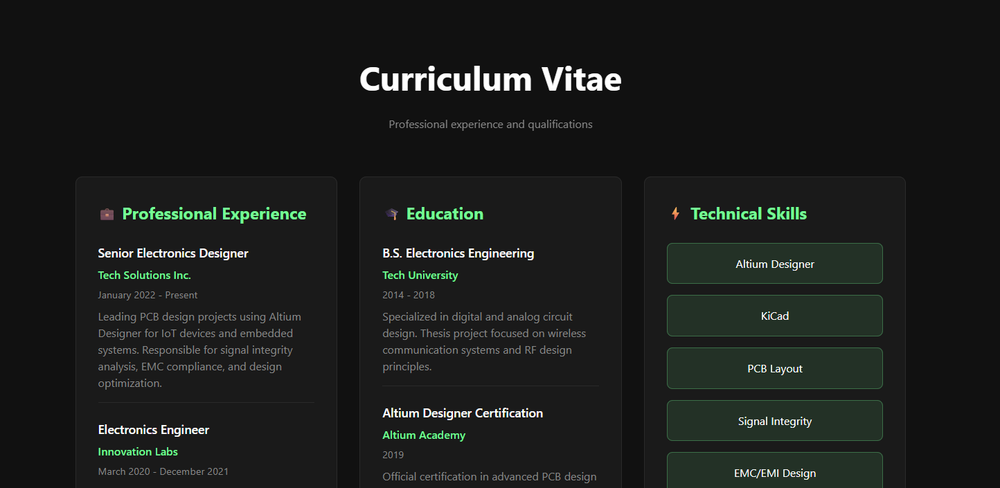
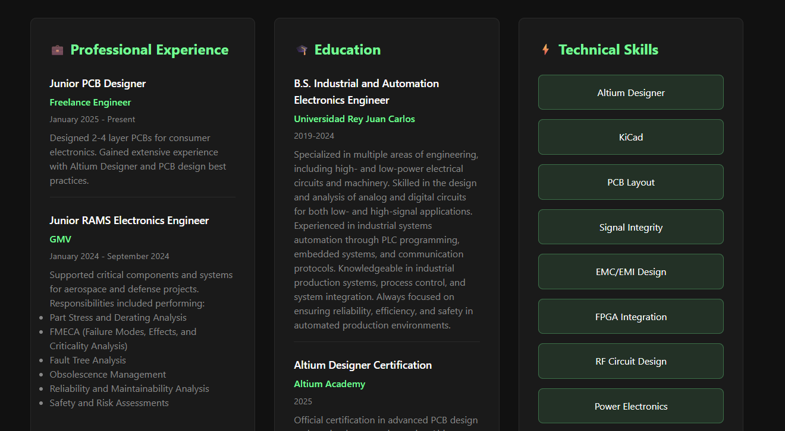
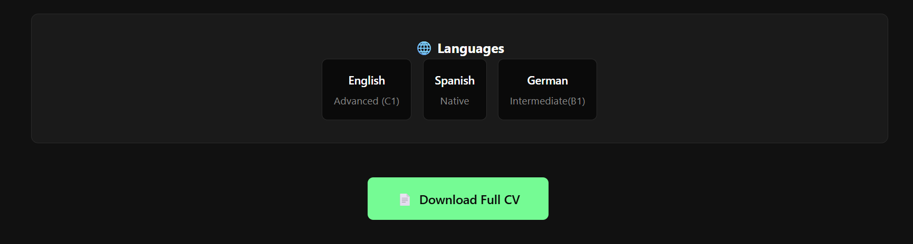

# PersonalWebPage

I will use this repository as a backup where I will save the latest and cleanest versions of my new web page. It's the first time I use HTML, so in case I mess things up, I'll have a working version to fall back on.

## Version History

### Version 2 - CV Integration

  

  

The CV section includes:

In version 2, I've added a complete CV section where I'll be showcasing my professional trajectory, education, languages, and technical skills. The CV section includes:

- **Professional Experience**: Detailed work history and responsibilities
- **Education**: Academic background and qualifications
- **Technical Skills**: Programming languages, tools, and technologies
- **Languages**: Proficiency levels in different languages

**Note**: The current content is placeholder data that needs to be customized with my actual information. The initial code structure was developed with assistance from Claude AI to ensure a solid foundation and best practices.

## Features
- Responsive design for all devices
- Modern CSS styling with gradient effects
- Clean and professional layout
- Easy to maintain and update

## Technologies Used
- HTML5
- CSS3
- Responsive design principles

## Future Updates
- Version 3: Portfolio section with project showcases
- Version 4: Contact form integration
- Version 5: Interactive elements and animations

### Version 3 - CV Modification

  

  

The CV section includes:

In version 2, I've modificated all my studies and certifications. Also all my hard skill. 

### Version 4 - Lenguages slot finished. 

  

  

Now the slot with the lenguages it's finished. I would like to put the flags of each lenguage but I couldn't do it. ;(
